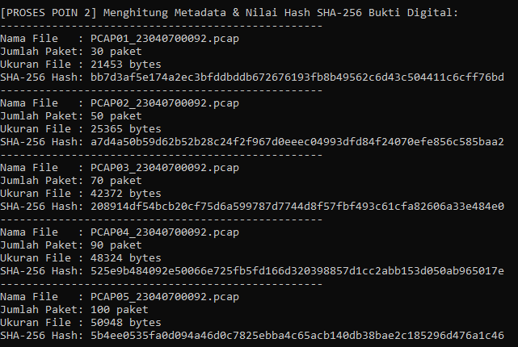
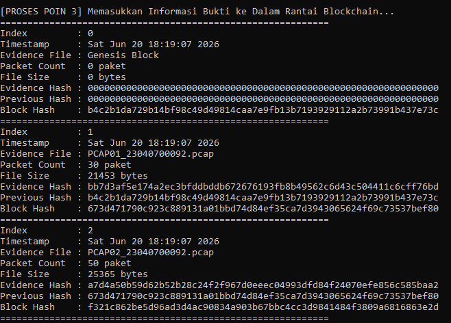
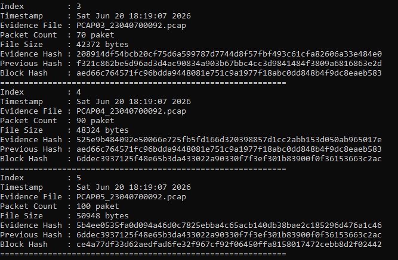

# Tugas Praktikum - Simulasi Blockchain untuk Barang Bukti PCAP

### Identitas Mahasiswa
* **Nama:** Muhammad Arifin Ilham
* **NIM:** 23040700092
* **Kelas:** A

### Deskripsi Tugas
Program ini mensimulasikan penyimpanan metadata bukti digital jaringan (file PCAP) ke dalam struktur Blockchain sederhana berbasis Python untuk menjaga aspek integritas dan *chain of custody*.

### Tools yang Digunakan
1. **Wireshark / tcpdump:** Untuk akuisisi paket data jaringan.
2. **Python 3.x:** Bahasa pemrograman utama.
3. **Scapy Library:** Untuk pembacaan jumlah paket file PCAP secara otomatis.

### Cara Menjalankan Program
1. Pastikan library scapy sudah terinstall: `pip install scapy`
2. Masuk ke direktori source code: `cd sourcecode`
3. Jalankan skrip: `python blockchain_pcap.py`

### Screenshot Hasil Eksekusi & Validasi

#### 1. Perhitungan Hash SHA-256 Bukti Digital

#### 2. Struktur Rantai Blockchain Bukti Digital

### ### Hasil Validasi Blockchain
* **Status Akhir:** `Blockchain Validation : VALID`